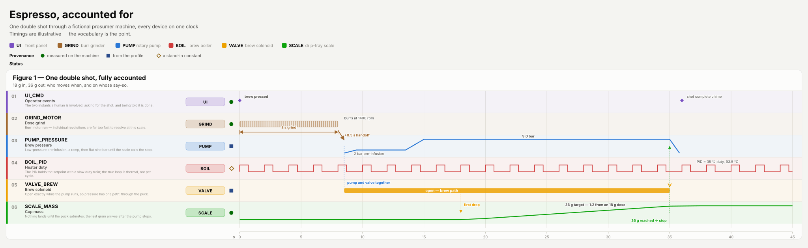

# wiggleroom

Lane-per-signal timing figures, rendered to SVG from declarative Python. Built for
timing-accounting work: many named signals against one time axis, every interval
carrying its provenance, and the cross-lane relationships drawn rather than
implied.



The figure above is [`examples/espresso/project.py`](examples/espresso/project.py)
— one page of declarative Python, rendered and checked by `python3 project.py`.
Dense fills for motors too fast to resolve, a logic train for PID duty, curves
for continuous quantities, pins for coincidence, arrows for cause, and a
self-check printing the interlocking numbers on every render.

The engine is stdlib-only — a project script runs anywhere Python does. Hi-DPI
PNG export shells out to a headless chromium found on the machine (playwright's
cache, or `WIGGLEROOM_CHROMIUM`).

```bash
pip install git+https://github.com/CosmicFrontierLabs/wiggleroom
```

## The model

A **Project** owns what every figure shares: header text, the device table (a
colour, badge and long name per device), the provenance and status mark
vocabularies, and where output goes. A **Figure** is a lane table on one time
axis. A **Lane** belongs to a device, carries a title, a sentence of detail, one
provenance mark, and a draw function that places marks through a **Ctx**.

Cross-lane relationships are first-class, addressed by lane key so reordering a
figure cannot silently repoint them:

- **Guide** — a vertical dotted line: one instant carried across lanes. With
  `arrow=False` it is a pin: two things coinciding, neither causing the other.
- **Link** — a diagonal arrow: something moving forward in time as it moves down
  a handoff, where the slope is the delay.

## Rules the vocabulary enforces

- **Marks are placed in time units, never pixels.** `Ctx` owns the mapping, so
  rescaling a figure cannot silently break half a lane.
- **Prose goes through `Ctx.note`**, which haloes it against whatever it crosses
  and slides it inward rather than off the edge.
- **`Ctx.span` contracts** to its label alone below 40 px, where a measured span
  is two arrowheads meeting in the middle.
- **Arrowheads resolve from the line colour.** SVG markers cannot inherit a
  stroke, so picking them independently silently produces two-tone arrows.

Two conventions worth adopting in a client: colour a pin by the lane it drops
*from*, so a colour always means "this device's instant"; and compute any
reported duration from true instants, never from drawn marks — sub-pixel
intervals get drawn wider than they are, and a number measured between drawn
marks moves when the figure is rescaled.

## Checks

Run on every render, because these are exactly the failures no eye catches:

- lane detail prose too long for the lane's height (silent truncation)
- annotations that had to slide to fit (an end-anchored label with no room
  slides *right*, over whatever is there)
- arrowheads whose colour disagrees with their line
- annotation text overlapping annotation text (boxes recorded as drawn;
  labels deliberately inside bars opt out at the source)
- lanes whose name does not start with their device (`device_prefixed=True`)
- `Figure.self_check` — a hook for figure-specific interlocking numbers,
  printed on every render so a stale constant surfaces immediately

## A new project

```python
# project.py
import pathlib, sys
from wiggleroom import Device, Figure, Lane, Mark, Project, instants

DEVICES = {d.key: d for d in (
    Device("PUMP", "#2a78d6", "PUMP", "coolant pump"),
    Device("CTRL", "#eda100", "CTRL", "controller"),
)}
PROVENANCE = {m.key: m for m in (
    Mark("measured", "●", "#046b04", "measured"),
    Mark("modelled", "◇", "#8a5a00", "a stand-in constant"),
)}

def duty(c):                                   # marks drawn in time units
    c.bar(0, 12.5, h=18)
    c.span(0, 12.5, "12.5 ms")

FIG = Figure(number=1, key="fill", name="Fill cycle", blurb="...",
             tmax=50.0, tstep=5.0, lanes=[
    Lane("PUMP_DUTY", "PUMP", "Duty window", "What the pump is doing and why.",
         duty, "measured"),
])

PROJECT = Project(title="...", subtitle="...", set_note="...",
                  devices=DEVICES, provenance=PROVENANCE, status={},
                  figures=[FIG], slug_prefix="fill-cycle",
                  out_dir=pathlib.Path(__file__).parent,
                  cache_dir=pathlib.Path.home() / ".cache" / "fill-cycle")

if __name__ == "__main__":
    from wiggleroom.cli import main
    main(PROJECT, sys.argv[1:])
```

```bash
python3 project.py                 # render + every check
python3 project.py export          # hi-DPI PNGs into the project cache
python3 -c 'from wiggleroom.serve import main; main("project", ".")'   # live preview
```

The preview server re-renders on every refresh and purges both the project and
the engine from `sys.modules` first, so editing either takes effect immediately;
a module that fails to import becomes a traceback in the page rather than a
stale figure. Hi-DPI exports are build artifacts: they go to the cache directory
and are offered for download from the preview page, never committed — the SVG is
the source.
